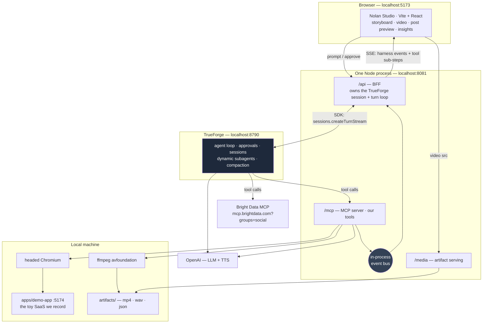
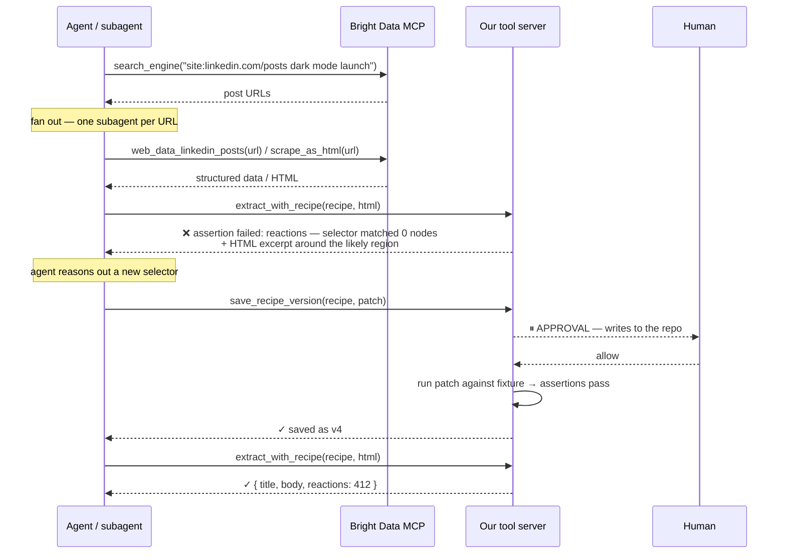

# Nolan — Project Plan

**An AI product-marketing agent built on [TrueForge](https://github.com/truefoundry/trueforge).**
You tell it what you shipped. It opens your product, records itself using the feature, narrates it,
drafts your launch posts, waits for your approval — then goes and finds out how the post did and how
the competition does it better.

Named for what it actually does: it directs the whole shoot end to end — writes the shot list, runs the
camera, records the voiceover, cuts the thing together, and comes back with notes for the next one.

One day. Three people. Everything runs on a laptop.

> **Plain-English version:** [`docs/plan-in-plain-english.md`](docs/plan-in-plain-english.md) — same plan,
> no jargon. If you only read one, read that one first and come back here for the specifics.

---

## 0. Read this first — assumptions, and three findings that changed the design

### Assumptions

| # | Assumption |
|---|---|
| A1 | ~10 working hours, 3 people (1 designer, 2 devs), all on macOS laptops. |
| A2 | Agent model `openai/gpt-5.5`. Verify the exact FQN in **Settings → Models** after configuring — the catalog `name` field is `gpt-5-5` while `model_id` is `gpt-5.5`, and the docs' FQN examples use `provider/model`. Any second configured provider is a one-line swap in the agent spec. |
| A3 | TTS is OpenAI `POST /v1/audio/speech`, model `gpt-4o-mini-tts`, fallback `tts-1`. Same key as the LLM, so one credential to manage. |
| A4 | **Publishing is mocked.** `publish_post` writes to a local outbox and renders a fake feed card. We say this out loud in the demo — judges punish hidden fakery, not disclosed scope cuts. |
| A5 | The product being recorded is **our own toy SaaS app** (`apps/demo-app`), which we control and can reset between takes. |
| A6 | Bright Data's free tier (5,000 requests/month, no card) covers us; the $50 credit is headroom, not a dependency. |
| A7 | The designer writes Tailwind/HTML but does not wire React state. They ship components in a static playground page; Dev 2 mounts them. |
| A8 | The repo is public and MIT-licensed from the first commit. |

### The three findings that changed the design

We read the TrueForge source and docs before planning. Three things are not what the brief assumed,
and pretending otherwise would have cost us the day.

**1. The harness sandbox cannot do our recording.**
`packages/trueforge/catalog/sandbox-catalog.yaml` lists exactly one provider: Daytona. The source has
`DaytonaProvider` and `TFYSandboxProvider` and no local provider. Both are cloud. A cloud sandbox
cannot reach a demo app on `localhost`, and it cannot screen-record your laptop.

So: **our Playwright, ffmpeg, and TTS tools live in our own local HTTP MCP server**, and the agent runs
with `config.sandbox.enabled: false`. This turns out to be the *better* architecture, and it is TrueForge's
own stated philosophy — "sandbox as a tool", the agent loop and credentials stay in the harness. Our tools
are a first-class MCP connector like any other. Nothing is smuggled in.

Consequence: **Skills are unavailable** (they require the sandbox). We mirror the pattern by hand —
versioned markdown playbooks in `playbooks/`, exposed through a `load_playbook(name)` tool so the agent
pulls them on demand rather than carrying them in the system prompt. Same progressive disclosure, our own plumbing.

**2. Subagents are dynamic, not named.**
There is no registry of "recorder agent / copywriter agent / analyst agent". The root agent calls a built-in
`create_sub_agent` tool with instructions *it generates at runtime*. One level deep, no nesting, and subagents
cannot talk to the user (though their tool calls still pause for approval).

So we don't fake a static org chart. We get fan-out where it genuinely helps and is genuinely visible:
**one subagent per competitor post URL** during the analysis phase. That is a real context-isolation win —
raw scrape payloads never touch the root agent's context — and it renders beautifully as parallel lanes in our UI.

**3. Bright Data is already a one-click connector in TrueForge.**
It ships in `mcp-catalog.yaml` pointing at `https://mcp.brightdata.com/mcp` with header auth. Anyone at this
hackathon can connect it in one click. **Using Bright Data wins nothing.** What wins is the layer we build
on top: version-controlled scraper recipes with assertions, and an approval-gated auto-repair loop that
commits its own fix. See §3 — that is where our track bet sits.

---

## 1. Scope — the minimum stellar demo

The instinct at a hackathon is to build everything thinly. We are doing the opposite: a narrow spine,
built properly, with every risky link pre-wired to a fallback.

### Build / Cut / Fake

| Build (the spine) | Cut (not this hackathon) | Fake, and say so |
|---|---|---|
| Toy SaaS demo app with a real dark-mode feature | Auth, accounts, multi-user | Publishing → local outbox + fake feed card |
| Local MCP tool server: record, narrate, stitch, publish, recipes | Cloud deploy of anything | "Your post's engagement" → one real scrape of a seeded post |
| Agent spec with two approval gates | Video editing UI / timeline scrubbing | Competitor set → 3 curated real public post URLs, not open-ended discovery |
| Custom Nolan Studio UI on the SDK | Multi-language TTS, voice cloning | The scraper "break" → a deliberately pinned stale selector |
| Bright Data recipe layer + auto-repair | Arbitrary target apps (works on *our* app) | — |
| Insights report + improved-prompt output | Analytics, history, saved campaigns | — |

### Every risky component has a pre-built fallback

This table is the contract. If a cell in the right column isn't *built and tested* by T+8, we have no demo.

| Component | Risk | Fallback ladder |
|---|---|---|
| Screen recording | macOS permission, notification banner, window geometry | `record_demo(mode:"page")` → Playwright `recordVideo` (headless, deterministic) → canned `artifacts/canned/demo.mp4` |
| TTS | Latency, API error mid-demo | Tool checks `artifacts/tts-cache/<hash>.wav` first; the demo script's narration is pre-rendered at T+8 |
| Live scraping | Blocked, rate-limited, slow | `SCRAPE_MODE=fixture` flips the entire pipeline to replay from `fixtures/` |
| ffmpeg stitching | Codec/container mismatch | Fixed encode params, tested at T+6; canned mp4 behind it |
| LLM | Provider outage | One-line model swap in the agent spec; a second provider pre-configured in Settings as standby |
| Wi-Fi | Venue network | Hotspot pre-joined; fixture mode + TTS cache + canned mp4 means only the LLM call needs network |

---

## 2. Architecture

### The shape of it

Four processes on one laptop:

- **TrueForge** (`:8790`) — the agent loop, approvals, sessions, subagents, compaction. We run it via `npx`, pointed at our repo's catalog file. We do not fork it.
- **Our Node process** (`:8081`) — Fastify with three routers: `/mcp` (our tools, as a real MCP server), `/api` (backend-for-frontend for the UI), `/media` (serves artifacts).
- **Nolan Studio** (`:5173`) — the UI. Vite + React, our own design, driven by the BFF's SSE stream.
- **Demo app** (`:5174`) — the toy SaaS the agent records.



### Why the tool server and the BFF are one process

They could be separate. Making them one buys three things:

1. **No CORS question.** The UI talks to one origin.
2. **One `pnpm dev`.** At hour 7 nobody wants to debug a fourth terminal.
3. **The one that actually matters:** a tool handler can push *sub-step* progress straight onto the UI's SSE channel over an in-process event bus.

That third point is the difference between an adequate UI and a winning one. The harness event stream tells
the UI "`record_demo` is running" and then, forty seconds later, "it finished". Our bus tells the UI
*"navigating to /settings · clicking Appearance · toggling dark mode · recording 0:07"* as it happens.
Judges watch the screen, not the logs. This is the cheapest large UI win available to us.

Module boundaries stay clean — `mcp/`, `bff/`, `media/`, `bus/` are separate modules with a thin composition
root — so "one process" is a deployment choice, not an excuse for a mud ball.

### Capability → harness primitive

This is the table the *Best Use of the Agent Harness* judges will actually read. Every row answers
"why is this the harness doing work, rather than your code doing work?"

| Capability | Realised as | Why not otherwise |
|---|---|---|
| Record the feature | `record_demo` tool on our MCP server | The harness sandbox is cloud-only; it can't see `localhost` or the screen |
| Voiceover | `synthesize_voiceover` tool | Deterministic side-effecting work belongs in a tool, not the model |
| Stitch video + audio | `compose_video` tool | Same |
| Write the posts | Root agent, **no tool** | It's a reasoning task. Wrapping it in a tool would be theatre |
| Decide *what* to record | Root agent writes the Playwright step list, passed to `record_demo` | The agent authors the script; the tool executes it. This is the harness doing the interesting half |
| Competitor research | **Dynamic subagents**, one per post URL | Raw scrape payloads stay out of the root agent's context; runs in parallel |
| Publish gate | `publish_post` annotated `@destructive` → default approval policy | Harness-native. Zero custom approval code |
| Recipe-repair gate | `save_recipe_version` annotated `@write` → default approval policy | It writes to the repo. A human signs the commit |
| Long-run stability | Compaction on, `iteration_limit: 80` | A full run is 30+ tool calls across two turns |
| Context discipline | `preload: false` + `enable_tools` whitelist on Bright Data | Bright Data alone is 69 tool schemas. We load 6 |
| Feedback loop | Part 2 is a **later turn in the same session** | Session persistence for free; the agent already knows what it made |
| Clarification | `ask_user_question` enabled | Used when the brief is ambiguous about which flow to record |

### Approval gates — where and why

The harness resolves approvals from the MCP server's own tool annotations, defaulting to
`["@write", "@destructive"]`. So we annotate correctly and gating is free. Two gates:

| Gate | Tool | The moment |
|---|---|---|
| **Publish** | `publish_post` (`destructiveHint: true`) | Agent has the video and both drafts. Full stop. User reviews, edits, approves |
| **Repair** | `save_recipe_version` (`readOnlyHint: false`) | Agent has diagnosed a broken selector and wants to write a new recipe version to the repo |

Note: **an approval ends the turn.** `turn.done.state.requiredActions` carries what's pending, and you resume
by creating a *new* turn with a `user.tool_approval` input item. The BFF must implement that resume path
explicitly — it is not automatic, and it is the single most likely place for Dev 2 to lose an hour.

Because `require_approval_for_tools` is API-only (not exposed in TrueForge's chat UI), **the agent must be
created via the SDK**, not clicked together. That's `harness/create-agent.ts`, committed and re-runnable.

### Event → UI mapping

| Harness event | UI response |
|---|---|
| `turn.created` | Storyboard resets to running; timer starts |
| `model.message` + `.delta` | Agent's reasoning streams into the narration strip |
| `thread.created` | **New parallel lane** opens in the storyboard, titled from `event.title` |
| `thread.done` | Lane collapses to a one-line result summary |
| `tool.response` | Step card resolves to ✓ with its result preview |
| `tool.approval_required` | Approval modal, populated by looking up `sourceEventId` in the event index |
| `mcp.initialize` | Connector chips light up in the header |
| `turn.done` + `metrics` | Cost chip: "this run cost $0.xx" |
| *(our bus)* `tool.substep` | Live sub-progress inside the running step card |

Dev 2 owns an `id`-keyed event index with `isEventDelta` / `mergeEventDelta`, bucketed **per `threadId`**,
because subagent events interleave with the root agent's on the same stream.

---

## 3. Bright Data pipeline — the track bet

**The thesis:** anyone can connect Bright Data in one click — it's in TrueForge's shipped catalog. So the
demo cannot be "we called a scraping API." It has to be:

> *We built a self-healing, version-controlled scraping layer on top of Bright Data,
> and a human approves every repair.*

### Recipes are code

```
scrapers/
  linkedin-post.recipe.yaml
  x-post.recipe.yaml
  competitor-blog.recipe.yaml
fixtures/
  linkedin-post.v3.html        # saved page snapshot
  ...
```

Each recipe is version-controlled and carries:

```yaml
name: competitor-blog
version: 3
target: "Competitor launch blog post"
url_pattern: "https://*/blog/*"
brightdata_tool: scrape_as_html      # which BD tool fetches it
extract:
  title:    { selector: "h1.post-title" }
  body:     { selector: "article .content", as: markdown }
  reactions:{ selector: "[data-testid='reaction-count']", as: number }
assertions:                           # what "working" means
  - field: title      ; rule: non_empty
  - field: reactions  ; rule: is_number
  - field: body       ; rule: min_length(200)
fixture: fixtures/competitor-blog.v3.html
```

The rules that keep this from decaying into one-off scripts live in `AGENTS.md` and `playbooks/scraping.md`:

- Never hand-write a selector inline. Everything goes through a recipe.
- A repair must pass the recipe's assertions **against the stored fixture** before it can be saved.
- A repair bumps `version` and writes a new file revision — the history is the audit trail.

### The flow



The key design choice: `extract_with_recipe` **fails informatively, not silently**. It returns which
assertion failed, which selector matched zero nodes, and an HTML excerpt around where that field probably
lives now. The agent does the reasoning; the tool does the verification. That division is what makes the
repair reliable rather than a hallucinated selector.

### Two-stage discovery

Verified against Bright Data's tool reference: `web_data_linkedin_posts` and `web_data_x_posts` each take a
**single post URL**. So discovery is necessarily two-stage — `search_engine` to find URLs, then one
structured fetch per URL. That's precisely the shape that makes subagent fan-out worth doing, and it renders
as parallel lanes in the UI.

Connector configuration:

- URL: `https://mcp.brightdata.com/mcp?groups=social,advanced_scraping` — **the `groups` param is required**; without it only the 5 base tools are enabled and `web_data_linkedin_posts` doesn't exist.
- `preload: false`, `enable_tools: ["search_engine", "scrape_as_markdown", "scrape_as_html", "extract", "web_data_linkedin_posts", "web_data_x_posts"]` — 6 of 69.

### The planned break

At T-1 we pin `competitor-blog.recipe.yaml` back to a stale selector version. On stage we say, plainly:

> *"We've pinned an old selector here to simulate the page having been redesigned since we wrote this."*

Deterministic, honest, no network trickery, reproducible on the third rehearsal. The payoff is `git diff`
on stage: the agent's approved patch, committed to the repo, with a bumped version.

*(Stretch: point the recipe at a GitHub Pages page we edit live during the demo. More dramatic, but CDN
caching makes it a coin flip. Not the main path.)*

### Reuse, demonstrated

The same recipe machinery drives all three targets — a LinkedIn post, an X post, and a competitor blog page,
through three different Bright Data tools. One engine, three configs, zero bespoke code per target.
That's the "reusable, not one-off" evidence.

---

## 4. Tech stack

Boring on purpose.

```
agent-harness-hackathon/
├── apps/
│   ├── studio-ui/          Vite + React 19 + Tailwind — our UI          [Designer + Dev 2]
│   ├── tool-server/        Fastify: /mcp + /api + /media                [Dev 1 + Dev 2]
│   │   ├── mcp/            our MCP tools
│   │   ├── bff/            TrueForge session loop + SSE to the UI
│   │   ├── media/          artifact serving
│   │   └── bus/            in-process event bus
│   └── demo-app/           Vite + React — the toy SaaS we record        [Designer]
├── harness/
│   ├── mcp-catalog.yaml    our connectors, loaded via MCP_CATALOG_PATH
│   ├── agent-spec.json     the agent, version-controlled
│   └── create-agent.ts     idempotent: registers the agent via the SDK
├── scrapers/               *.recipe.yaml
├── playbooks/              marketing.md, recording.md, scraping.md
├── fixtures/               cached scrapes + HTML snapshots
├── artifacts/              mp4/wav/json  (gitignored, except canned/)
├── docs/code-quality.md    Qodo evidence
├── AGENTS.md               project rules the agent and we both follow
└── README.md
```

**Dependencies** (pin exact versions — these packages are days old):

| | |
|---|---|
| Runtime | Node ≥ 22.14, pnpm workspace |
| Harness | `@truefoundry/trueforge@0.1.4` (via npx), `@truefoundry/trueforge-sdk@0.1.3` |
| Tool server | `fastify`, `@modelcontextprotocol/sdk`, `playwright`, `execa`, `zod`, `yaml` |
| UI | `react@19`, `vite`, `tailwindcss`, `lucide-react` |
| System | `ffmpeg` (Homebrew) |

> **Version warning.** `@truefoundry/trueforge` published `0.1.4` on 2026-08-27 — days before the hackathon.
> Expect rough edges and undocumented behaviour. Pin every version. The hour-0 spike is not optional.

### The recording recipe, concretely

These are the details that cost hours if you discover them at hour 5.

**Launch Chromium headed, at a known position:**

```ts
const browser = await chromium.launch({
  headless: false,
  args: [
    '--window-position=0,0',
    '--window-size=1280,800',
    '--disable-blink-features=AutomationControlled',
  ],
  ignoreDefaultArgs: ['--enable-automation'],   // kills the "controlled by automated software" infobar
});
```

That infobar is a yellow banner across the top of every frame if you forget. It ruins the video.

**Find the screen device index — it varies per machine:**

```bash
ffmpeg -f avfoundation -list_devices true -i ""
# → look for "Capture screen 0"; the index depends on how many cameras are attached
```

**Capture:**

```bash
ffmpeg -f avfoundation \
  -capture_cursor 1 -capture_mouse_clicks 1 \
  -framerate 30 -i "<screen-index>:none" \
  -vf "crop=2560:1600:0:0" \
  -c:v libx264 -preset ultrafast -pix_fmt yuv420p \
  artifacts/raw.mp4
```

Three traps in that command:

1. **`-capture_cursor 1`** — without it there is no cursor, which throws away the entire reason we chose screen capture over Playwright's built-in recorder.
2. **Retina scaling.** Playwright reports CSS pixels; avfoundation captures physical pixels. On a Retina display the crop geometry must be **multiplied by the backing scale factor (2)**. A 1280×800 window is a 2560×1600 crop.
3. **Stopping.** Write `q` to ffmpeg's stdin. Do **not** `SIGKILL` — the mp4 will have no moov atom and won't play. This is the classic "the file is 40MB and QuickTime says it's corrupt" failure, discovered five minutes before demo.

**Stitch:**

```bash
ffmpeg -i raw.mp4 -i voice.wav -c:v copy -c:a aac -shortest artifacts/demo.mp4
```

**The flag-gated fallback** — `record_demo({ mode: "page" })` uses Playwright's own recorder:

```ts
const context = await browser.newContext({
  recordVideo: { dir: 'artifacts/', size: { width: 1280, height: 720 } },
});
```

Headless, deterministic, zero OS permissions, known output path. No cursor — we compensate with a spotlight
overlay injected into the page on each click. This path must be **built and tested**, not theoretical.

---

## 5. Task breakdown — by person, by hour

Three lanes, chosen so the two devs never edit the same file. Merge conflicts at hour 7 are a real cost.

| Hour | 🎨 Designer | 🔧 Dev 1 — harness, agents, media | ⚙️ Dev 2 — BFF, UI wiring, Bright Data |
|---|---|---|---|
| **0–1** | Repo scaffold, brand, demo-app wireframe. Install Qodo app | **Spike:** TrueForge running, OpenAI configured, one real agent chat working | **Spike:** Bright Data connector with `?groups=social`, one live `search_engine` call returning URLs |
| **1–2** | `apps/demo-app` UI — it must look like a real product on camera | MCP server skeleton + 5 stub tools returning canned data; `harness/mcp-catalog.yaml` | Fastify BFF: SSE endpoint, event index, delta merge, per-thread buckets |
| **2–3** | Nolan Studio comps: storyboard lanes, approval modal, empty states | `harness/create-agent.ts` — agent spec via SDK, tool annotations set | Wire UI → BFF → TrueForge. Approval resume path |
| **T+3** | 🚩 **Checkpoint A — end-to-end on stubs.** Prompt goes in, fake steps stream to the UI, fake approval pauses and resumes, fake video plays. Nothing real yet, everything connected. | | |
| **3–5** | Video intro/outro cards, post-preview components | `record_demo` for real: Chromium + ffmpeg crop + cursor + the three traps above | Recipe schema, `extract_with_recipe`, assertion engine, first fixtures |
| **5–6** | Insights report components | `synthesize_voiceover` + `compose_video` + TTS cache | Two-stage BD pipeline; the subagent fan-out prompt |
| **T+6** | 🚩 **Checkpoint B — a real narrated mp4 plays in our UI.** If this slips, we drop Part 2 and ship a beautiful Part 1. | | |
| **6–8** | Polish: loading, empty, error states. README + submission visuals | Playbooks, prompt tuning, run timing (the demo has a clock) | `save_recipe_version` + approval gate + the full auto-repair beat |
| **T+8** | 🛑 **Feature freeze. Nothing new is written after this line.** | | |
| **8–9** | Demo assets, slide, blog visuals | Rehearsal 1. Record the canned fallback mp4 | Rehearsal 1. Cache every scrape to `fixtures/` |
| **9–10** | — | Rehearsals 2 and 3, including fallback drills | Rehearsals 2 and 3, including fallback drills |

### Checkpoint rules

- **T+3 (Checkpoint A)** is the most important moment of the day. An end-to-end skeleton on stubs means every integration seam is already proven, and the rest of the day is filling in boxes. Teams that skip this discover their seams at hour 8.
- **T+6 (Checkpoint B)** is the go/no-go on Part 2. Real video in our UI or we cut the analysis loop and ship Part 1 flawlessly. A perfect half is worth more than a broken whole.
- **T+8 is a hard freeze.** The last two hours are rehearsal, and rehearsal means running the *whole* demo, start to finish, three times — including deliberately triggering each fallback once.

---

## 6. Qodo workflow

Even at hackathon speed, PR-based. The merge history *is* the Code Quality submission.

**Set up at hour 0**, not hour 8:
- Install the Qodo Merge GitHub App (free for open-source; 75 PR reviews/org/month).
- Commit `.pr_agent.toml` with review focus set to correctness and security.
- Branch protection on `main`: no direct pushes. This holds at hour 9 too — that's the point.

**Per slice:**
1. Branch: `feat/record-demo-tool`, `feat/recipe-engine`, …
2. PR under ~300 lines. If it's bigger, it's two PRs.
3. Qodo `/review` runs automatically on open.
4. Author addresses findings; `/improve` before merge.
5. One human approval, then squash-merge.

**Evidence for the track** — `docs/code-quality.md`, filled in as we go, not reconstructed at the end:
- Every PR link with its Qodo review.
- Screenshots of the review comments.
- **2–3 specific, named catches:** "Qodo flagged that `record_demo` leaked the Chromium process on an ffmpeg
  failure — fixed in `a1b2c3d`." Judges want a specific bug caught and fixed, not a screenshot of a bot saying "LGTM".

---

## 7. Demo script — 3 min 30 s

Two rules: **the agent's screen is the star**, and **the presenter narrates what's about to happen, not what just happened.**

| Time | Beat | What the presenter says | What's on screen |
|---|---|---|---|
| **0:00–0:20** | The problem | "Every time we ship a feature, someone loses a day making a demo video and writing the posts. This agent does that day." | Nolan Studio, empty state, clean |
| **0:20–0:45** | The prompt | "One sentence. That's the whole input." | Types: *"We just shipped dark mode in our dashboard. Make a launch video and a post for LinkedIn and X."* Storyboard lanes start filling |
| **0:45–1:25** | 🎬 **The money shot** | "It's writing its own Playwright script, and now it's using our product." | Chromium opens the demo app and drives itself — cursor visible, clicking through to dark mode — while the step feed narrates *in sync* |
| **1:25–1:50** | Narrate + stitch | "Voiceover from the script it wrote. ffmpeg stitches it." | Video renders; plays **inside our UI**; LinkedIn and X drafts appear side by side |
| **1:50–2:10** | ⏸ **Approval gate** | "It will not publish anything without me. This is the harness's approval gate — the turn is genuinely stopped." | Modal shows exactly what will be published. Edit one line. Approve. Fake feed card appears |
| **2:10–2:35** | Second turn, same session | "Same session — it already knows what it made. Now: how did it do?" | Subagent lanes fan out in parallel across competitor posts. Bright Data chips light up |
| **2:35–3:00** | 🔧 **The break** | "We pinned an old selector here, to simulate this page being redesigned. Watch." | Recipe fails its assertions. Agent diagnoses, proposes a patch, **asks for approval**. Approve. Re-runs green. `git diff` on screen |
| **3:00–3:30** | The payoff | "Insights from what actually performs — and a better prompt for next time." | Insights report + rewritten prompt. Close on the cost chip: *this entire run cost $0.xx* |

### If it breaks

| Beat | If it fails | Say this, press that |
|---|---|---|
| 0:45 recording | ffmpeg/permission | "We have a headless path too—" → toggle `mode:"page"`, re-run |
| 0:45 both fail | — | "Here's the one it made ten minutes ago" → canned mp4, keep moving |
| 1:25 TTS | Latency | Cache hits automatically; if not, "using the pre-rendered take" |
| 2:10 scraping | Network/blocked | `SCRAPE_MODE=fixture` → "running against our cached scrapes" |
| Anything | Total failure | Full recorded screencast of the demo, ready to play |

**Rehearse the fallbacks.** Trigger each one at least once during hours 9–10. A fallback nobody has pressed is not a fallback.

---

## 8. Risk register

Ranked by expected damage. Each fallback must be **built and tested by T+8**, with a named owner.

| # | Risk | Likelihood | Fallback (pre-built) | Owner |
|---|---|---|---|---|
| **1** | **macOS screen recording fails** — permission not granted, notification banner across the frame, window geometry wrong on a different display | High | Screen Recording permission granted to the terminal **the night before**; Do Not Disturb on; display resolution fixed; `record_demo(mode:"page")` Playwright path built and tested; canned mp4 last | Dev 1 |
| **2** | **Live scraping blocked or slow** — LinkedIn/X bot protection, rate limits, latency | Medium-High | Every scrape written to `fixtures/` during development; `SCRAPE_MODE=fixture` env flag flips the whole pipeline to replay; demo can run fully offline | Dev 2 |
| **3** | **TrueForge rough edges** — 0.1.x published days ago, undocumented behaviour, especially the approval-resume path | Medium-High | Hour-0 spike is non-negotiable; all versions pinned; TrueForge Discord open in a tab; BFF can fall back to a scripted event replay for the UI | Dev 1 + Dev 2 |
| **4** | **TTS or ffmpeg fails mid-demo** — API latency, codec mismatch, moov atom | Medium | Narration for the exact demo script pre-rendered into `artifacts/tts-cache/`; encode params fixed and tested at T+6; ffmpeg stopped with `q`, never SIGKILL | Dev 1 |
| **5** | **Venue Wi-Fi** | Medium | Phone hotspot pre-joined and tested; with fixture mode + TTS cache + canned mp4, only the LLM call needs network; full offline screencast of the demo as the true last resort | Designer |

**The meta-risk: scope creep past T+8.** The freeze is the mitigation, and it only works if it's agreed now,
in writing, while everyone is calm. Sign up to it at hour 0.

---

## 9. Stretch goals

**Only** after T+8 with both checkpoints green. Ranked by demo value per hour.

| | Stretch | Why it's worth it | Cost |
|---|---|---|---|
| **a** | Configure Daytona so the insights report is generated as a real artifact via a TrueForge **Skill** | Adds the one harness primitive we're not using; makes the harness story complete | ~1h + a Daytona key |
| **b** | Point the scraper break at a live GitHub Pages page we edit on stage | Genuinely live rather than a pinned stale selector | ~45m, CDN-cache risk |
| **c** | Zoom/pan effects in `compose_video` (ffmpeg `zoompan`) | Makes the output video look professionally edited | ~1h |
| **d** | A second demo app, to prove the agent isn't hard-coded to one product | Directly answers the loudest judge question | ~1.5h |
| **e** | `mode:"page"` as a user-facing fidelity toggle in the UI | Turns a fallback into a feature | ~20m |

---

## Appendix — one-command setup

```bash
pnpm install
cp .env.example .env          # OPENAI_API_KEY, BRIGHTDATA_API_TOKEN
pnpm harness                  # MCP_CATALOG_PATH=./harness/mcp-catalog.yaml npx @truefoundry/trueforge
pnpm setup:agent              # tsx harness/create-agent.ts — registers the agent "nolan" via the SDK
pnpm dev                      # tool-server :8081 · studio-ui :5173 · demo-app :5174
```

Because `harness/mcp-catalog.yaml` is loaded via `MCP_CATALOG_PATH`, our local tool server and a
pre-configured Bright Data entry appear in TrueForge's Connectors list out of the box. A judge clones the
repo, adds two keys, and runs it.

### Sources

Everything asserted about TrueForge above was read from the repo at `truefoundry/trueforge@main`:
`README.md`, `docs/introduction.mdx`, `docs/quickstart.mdx`, `docs/sandbox.mdx`,
`docs/create-agent/overview.mdx`, `docs/mcp-servers.mdx`, `docs/harness/initial-setup.mdx`,
`docs/key-features/overview.mdx`, `docs/key-features/subagents.mdx`, `docs/api/use-agent.mdx`,
`packages/trueforge/catalog/*.yaml`, `packages/trueforge-core/src/core/sandbox/provider/`.
Bright Data tool names and the `groups` parameter from `brightdata/brightdata-mcp`
(`README.md`, `assets/Tools.md`).
